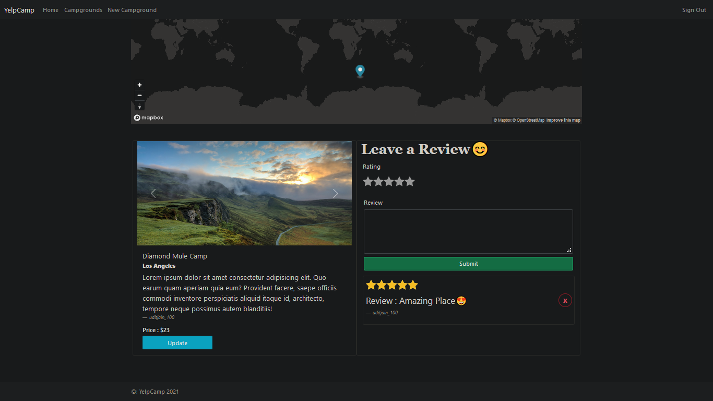

# 🏕️ YelpCamp2021

**YelpCamp2021** is a full-stack, dynamic web application that allows users to discover and interact with campgrounds across various locations. Built with **Node.js**, **Express.js**, **MongoDB**, and **EJS** templating, the project implements secure user authentication, interactive mapping, image upload, and complete **CRUD (Create, Read, Update, Delete)** functionalities. It is inspired by platforms like Yelp, tailored specifically for campground enthusiasts who want to share their experiences and explore new sites.

This project offers an end-to-end experience—from user registration to posting, viewing, reviewing, and deleting campgrounds—all in a user-friendly and responsive interface. Integrated with **Cloudinary** for image storage and **Mapbox** for geographical visualization, it provides both functionality and aesthetics. It's a solid foundation for learning backend development with Express, RESTful routing, and third-party API integration.

### 🔍 Key Highlights

- **User Authentication and Authorization** – Users can register, log in, and are only allowed to edit/delete content they created.
- **Interactive Campground Listings** – Each campground includes a name, image, description, location, price, and creator attribution.
- **Full CRUD Support** – Users can create new campgrounds, view all or specific ones, edit their details, or delete them.
- **Review and Rating System** – Logged-in users can leave 1–5 star ratings and comments on any campground. Reviews are dynamically shown with delete options for owners.
- **Map Integration with Mapbox** – Each campground is geocoded and displayed on an interactive map, both in the list and detail view.
- **Cloudinary Image Hosting** – Uploaded images are securely hosted and rendered via Cloudinary, supporting multiple formats and responsive delivery.
- **Responsive Design with EJS Templates** – Views are clean, consistent, and dynamically generated using Embedded JavaScript Templates (EJS).

---

## 📌 Table of Contents

- [Features](#features)
- [Prerequisites](#prerequisites)
- [Installation & Setup](#installation--setup)
- [Environment Variables](#environment-variables)
- [Project Walkthrough](#project-walkthrough)
  - [Homepage](#1-homepage)
  - [Campgrounds List](#2-campgrounds-list)
  - [Campground Details & Reviews](#3-campground-details--reviews)
- [Technologies Used](#technologies-used)
- [Project Structure](#project-structure)
- [Author](#author)
- [License](#license)

---

## ✅ Features

- User authentication and session management
- Add, edit, delete campgrounds
- Add and delete reviews
- Search campgrounds by name
- Map integration using Mapbox
- Cloudinary for image hosting
- Responsive UI with EJS templating

---

## 📦 Prerequisites

Before you begin, ensure you have the following installed:

- [Node.js](https://nodejs.org/en/) (v14 or above)
- [MongoDB](https://www.mongodb.com/try/download/community)
- [Git](https://git-scm.com/)
- Internet connection (for Mapbox and Cloudinary API access)

---

## 🚀 Installation & Setup

Follow the steps below to set up the YelpCamp2021 project on your local system:

```bash
# 1. Clone the Repository
# This will download the project files from GitHub.
git clone https://github.com/uditjain100/YelpCamp2021.git
cd YelpCamp2021

# 2. Install Project Dependencies
# Use npm to install all required Node.js packages defined in package.json.
npm install

# 3. Configure Environment Variables
# Create a `.env` file in the root directory and add the following:
CLOUDINARY_NAME=your_cloudinary_name
CLOUDINARY_KEY=your_cloudinary_key
CLOUDINARY_SECRET=your_cloudinary_secret
MAPBOX_TOKEN=your_mapbox_token
MongoDB_URL=your_mongodb_connection_string

# Example for local MongoDB:
# MongoDB_URL=mongodb://localhost:27017/yelp-camp

# 4. Start MongoDB Locally (if not using MongoDB Atlas)
mongod

# 5. Start the Application
# You can run using node or nodemon (nodemon auto-restarts on file changes).
node app.js
# Or
npx nodemon app.js

# 6. Open the Application in Browser
# Navigate to the local development server.
http://localhost:3000

# 7. Seed Dummy Campgrounds (Optional for Testing)
# Before running the seed script, sign up on the app and copy your new user's MongoDB ObjectId.
# Then open `index.js` and replace the value of `author` with your ObjectId:
#     author: "6819d28156b0d5133da1155d"
# Finally, run:
node index.js
# This will populate your database with sample campground entries.
```

---

## 🌍 Environment Variables

Ensure your `.env` file contains the following:

```
CLOUDINARY_NAME=your_cloudinary_name
CLOUDINARY_KEY=your_cloudinary_key
CLOUDINARY_SECRET=your_cloudinary_secret
MAPBOX_TOKEN=your_mapbox_token
MongoDB_URL=your_mongodb_connection_string
```

---

## 🌐 Project Walkthrough

### 1. 🏠 Homepage


- Upon visiting the root URL (`/`), users land on a visually appealing homepage with a sunset background and nature-themed design.
- The **navigation bar** at the top displays links to `Home`, `Campgrounds`, `Sign In`, `Register`, or `Sign Out` (if authenticated).
- A prominent heading welcomes users to YelpCamp.
- A **"View Campgrounds"** button directs users to explore the list of available camps.
- If logged in, users also see a message confirming their login status.

---

### 2. 🏕️ Campgrounds List Page (`/campgrounds`)


- This page shows **all existing campgrounds** stored in the database.
- At the top, an embedded **Mapbox map** displays pins for each campground's location, providing a geographic overview.
- Below the map, there's a **search bar** allowing users to search campgrounds by name or keyword.
- The main section consists of **cards** for each campground featuring:
  - A responsive image carousel (images hosted on Cloudinary)
  - The campground's title
  - A short description
  - The city/location name
  - Action buttons:
    - **"Details"**: View detailed information about the campground
    - **"Delete"**: Remove the campground (only visible to its creator)
- A **"New Campground"** button is available for logged-in users to add a new campground.

---

### 3. 🧾 Campground Details & Reviews (`/campgrounds/:id`)



- Clicking the "Details" button leads to a dynamic route for that campground.
- This page presents:
  - A large header with the campground name and a photo gallery
  - A description paragraph explaining more about the site
  - Geographic location and pricing
  - Mapbox-powered **world map marker** showing exact coordinates
  - Information about the campground's creator
  - If you're the creator, you'll see **Edit** and **Delete** buttons
- Below the campground details, there's a **Reviews** section:
  - Authenticated users can add reviews using a **star rating system** and comment box
  - Reviews are displayed in a timeline view with:
    - Username of reviewer
    - Star rating (1 to 5)
    - Review content
    - A **Delete** button (only for the user who wrote it)
- Users can continue to explore or return to the main campground list using navbar links.

---

## 🛠 Technologies Used

- **Node.js**
- **Express.js**
- **EJS**
- **MongoDB & Mongoose**
- **Passport.js**
- **Mapbox**
- **Cloudinary**
- **Bootstrap (Optional)**

---

## 📁 Project Structure

```
YelpCamp2021/
├── app.js                        # Main Express app entry point
├── index.js                     # Optional alternate entry or mapbox setup
├── RandomImage.js               # Logic for rotating homepage image (if used)
├── LICENSE                      # License file
├── README.md                    # Project documentation
├── package.json                 # Project dependencies
├── package-lock.json            # Lockfile for consistent dependency versions

├── cloudinary/                  # Cloudinary config for image uploads
│   └── index.js

├── controllers/                 # Route logic for MVC architecture
│   ├── campgrounds.js
│   ├── reviews.js
│   └── users.js

├── layouts/                     # Layout templates
│   └── boilerplate.ejs

├── middleware.js                # Custom middleware (auth checks, etc.)

├── models/                      # Mongoose schema definitions
│   ├── campground.js
│   ├── review.js
│   └── user.js

├── partials/                    # Reusable EJS partials
│   ├── flashmsg.ejs
│   ├── footer.ejs
│   ├── nav.ejs
│   └── search.ejs

├── public/                      # Static assets
│   ├── javascripts/
│   │   ├── mapboxShow.js
│   │   ├── mapCluster.js
│   │   └── validate-form.js
│   └── stylesheets/
│       ├── home.css
│       ├── search.css
│       ├── stars.css
│       └── na.jpeg              # Fallback/default image

├── routers/                     # Route definitions
│   ├── campgrounds.js
│   ├── reviews.js
│   └── users.js

├── seeds/                       # Seed data for DB population
│   ├── cities.js
│   └── seedhelpers.js

├── ulits/                       # Utility scripts
│   ├── CatchAsyncError.js
│   ├── ExpressError.js
│   └── validateSchemas.js

├── views/                       # All rendered EJS views
│   ├── auth/
│   │   ├── signin.ejs
│   │   └── signup.ejs
│   └── campground/
│       ├── campgrounds.ejs
│       ├── details.ejs
│       ├── error.ejs
│       ├── home.ejs
│       ├── newCamp.ejs
│       └── update.ejs

├── Home.png                     # Homepage screenshot
├── Camps.png                    # Campgrounds page screenshot
└── Details.png                  # Campground detail page screenshot
```

---

## 👤 Author

- **Name**: Udit Jain
- **GitHub**: [uditjain100](https://github.com/uditjain100)

---

## 📌 License

This project is open source and available under the [MIT License](LICENSE).
